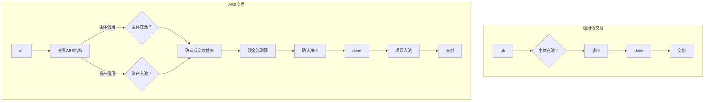

## 交易流程
ABS与信用债交易流程相比更复杂，主要多出三个重要步骤：
- 前期，入池判断：查看ABS底层结构，确认能否入池
- 中期，净价核算：根据确认的成交收益率确定交易净价（可能出现净价分歧，导致交易失败)
- 后期，债券入池：交易敲定后，需在交割前完成入池流程

ABS与信用债的二级交易流程对比：

净价计算
一次性还本型、固定摊还型ABS可直接计算，过手摊还型需要预测实际还本节奏

净价计算的核心逻辑：未来现金流折现