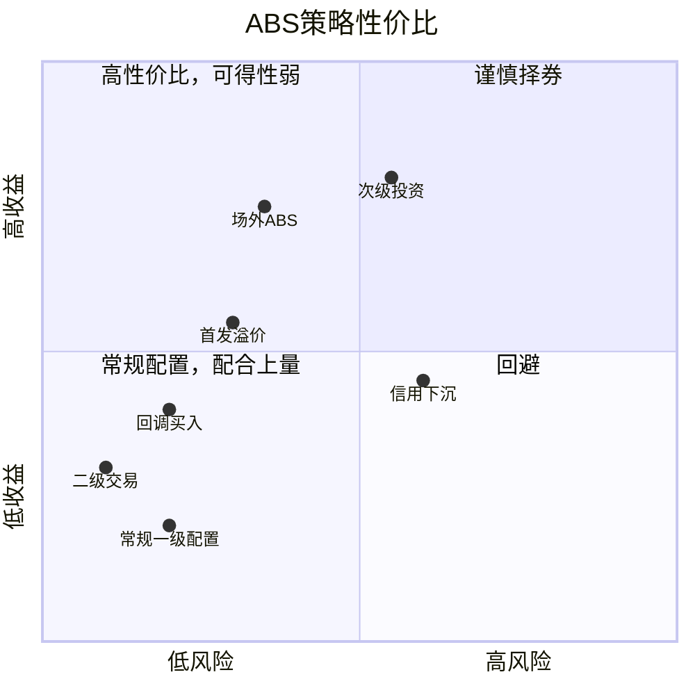

# 2025年ABS年度展望
{: .no_toc }

- TOC
{:toc}

## 市场供需

**整体格局：** 当前ABS板块净融资基本持平，主线仍为“资产荒”，品种利差反弹可能性不大。2025年整体格局ABN和部分板块可能有一定增量，但增幅预计有限。

**潜在增量板块：** 消金小微、应收应付、类REITs、NPL为当前配置和交易关注度较高的主流品种，2025年可能有一定供应增幅，但实际增幅受监管态度影响。
品种利差预计持续下行，关注市场回调行情及结构性机会。

**整体风险：** 
- 零售类资产风险有一定走高趋势，但绝对水平还不高，需进一步观察；
- 弱增信类目前认可度较高，发行人以央企及央企子公司为主，但新发结构趋弱，有待观察；
- 不动产类仅剩优质主体，关注板块复苏进程。
在2025年不发生显著宏观冲击的前提下，ABS整体风险预计保持相对稳定。

**策略建议：** 
抓住市场回调趋势，关注结构性机会。板块策略上，零售类维持策略，持续关注，谨慎下沉；弱增信类对负债情况较健康的主体做适当增配；不动产类及其他关注个券机会。

## 发行供给

整体发行规模有所回升，但未来上升空间不大，部分品种增量取决于监管导向。

- **信贷ABS**：整体规模下滑，主流品种为车贷、小微、不良，潜在增量有限，不良看政策。
- **企业ABS**：占据ABS全市场6成左右，主流品种为融资租赁、应收应付、消金小微、类REITs，类REITs增量明显。
- **ABN**：消金放开后有增量，品种与企业ABS接近。

## 板块展望

### 分散类
**整体趋势：** 新增投放低迷，资产风险缓慢上升，优先级/夹层整体风险可控，次级需谨慎。

**宏观背景：** 
- 社融弱化，信贷资产供给端增速受限；
- 经济下行，资产质量承压。

#### 消金
监管政策方面，互联网平台监管进入常态化阶段，在促消费的大背景下预计不会出现明显的政策紧缩或者资金紧缩，但目前对助贷业务模式的监管趋严，监管反复强调银行应提升独立风控能力，并限制助贷平台依靠市场支配地位将风险向银行端传导，预计后续监管方向仍是严格的合规管理，但不会有超预期的其他过多限制。

获客方面，马太效应明显，消费低迷环境下的加速内卷使得头部机构受益，主流平台余额基本到达瓶颈期（除抖音、腾讯分付等新玩家），获客成本显著增高，对客利率缓慢下行，拥有强流量（抖音、蚂蚁、腾讯、百度等）或强消费场景（蚂蚁、京东、美团等）的平台仍能保持竞争优势，中小平台加速出清。未来保持强者恒强、下游出清竞争格局的概率较大。

资产质量方面，受宏观经济压力影响，疫情放开后未出现类似2020的快速好转，多数平台贷款质量轻微恶化，但整体未超预期。由于业内在疫情期间普遍进行了风控政策收紧，预计短时间内不会出现资产显著恶化的情况。有场景的消费贷风险显著优于无场景现金贷。

负债端，在利率下行、资产荒的大背景下，银行助贷、ABS配置需求旺盛，负债端成本持续下降，构成利好。

整体看，消金ABS底层资产质量在可控范围内缓慢下行，优先级的信用风险仍较小，但在目前的宏观经济环境下，不排除资产质量在2025年进一步恶化的可能，需对资产质量保持关注。

**2025年预期**
- **中性预期：** 宏观经济维持偏弱运行，头部平台规模平稳，逾期率小幅走高，利润下降，合规压力进一步加大，中小平台出清。ABS优先级和夹层基本不受影响。
- **乐观预期：** 消金行业的政策面和资金面迎来双重宽松，居民消费扩张，资产质量出现拐点，二线以上平台财务指标向好。
- **悲观预期：** 监管政策加码导致助贷资金收紧，叠加经济走弱，逾期率上升导致贷后管理压力增大，部分平台出现明显的舆情/司法风险，并反应到ABS利差，夹层利差快速分化，部分次级兑付出现风险。

#### 租赁
##### 综合性租赁：关注城投板块边际变化
{: .no_toc }
城市公用板块投放量较大，处于转型过程中，资产质量和负债端目前较稳定。但其本身的非标属性和城投相关风险仍为最大的不确定性，需进一步观察边际变化。此类ABS发行多数带有发行人差补，部分项目逻辑上也体现为主体信用。
##### 汽车租赁：乘用车质量下滑，商用车周期待验证
{: .no_toc }
内在逻辑接近消金，更多新能源车入池，汽车融资租赁业务受银行渠道挤压效应明显，资产明显下沉，具体风险变化情况有待进一步观察，但优先级在适当的资产分散度下仍有较高的稳健性。资产风险方面，主机厂系租赁公司优于第三方，乘用车优于商用车，新车优于二手车。其中，商用车资产表现有所好转，但整体景气度复苏有待验证。
##### 其他专业租赁：关注细分行业龙头
{: .no_toc }
如小微、医药、机械设备等细分领域的租赁资产，发行人之间差异较大，关注行业景气度、竞争能力、资产质量，收益角度仍有一定挖掘空间。

#### NPL
不良ABS作为分散类资产中的异类，不具有本息流入的确定性，逻辑更接近收益权资产，重点关注现金流覆盖倍数和行业景气度。

当前NPL市场特点：
- 发行需求强劲
- 收益率整体下行，但利差仍高于其他品种
- 回收预计承压

整体不良市场，规模快速增长，但经济下行+合规压力导致回款难度提升，ABS优先级一般设定了充分的压力测试，信用资质整体问题不大，但次级更为依赖资产包质量和整体催收行业环境，重点关注现金流覆盖倍数较高的项目。

### 主体类

#### 强增信
增信主体承担担保、差额补足、共同债务人等刚性兑付义务，且主体在池的，跟随信用债配置策略，基本可视为同一主体发行的私募信用债。

#### 弱增信
增信主体承担流动性支持、可选择回购、分档增信、隐性声誉关联等非刚性兑付义务，以央企无增信应收账款、电力类REITs为代表，考察增信机构对ABS项目的实际控制情况和声誉关联度，以及入池资产质量、增信条款、内部分层提供的内部安全边际。此类项目严控主体资质。

目前新发行结构有进一步削弱增信效力的趋势，有待进一步观察。

### 不动产类
体现为资产信用和主体信用的双重支持，当前主要发行人以强资质央国企为主，整体风险较小。

由于房地产市场整体仍为见底，对于以商业物业为底层资产的项目，主体信用或重于资产信用。对于夹层、权益级等主体信用关联较弱的ABS，关注底层项目持续运营情况和估值安全边际。

## 投资策略

ABS整体供应进入相对稳定的低速增长阶段，板块利差在当前供需环境下反弹难度较大，但ABS相对于信用债仍保有一定的绝对收益优势，在当前的债市内卷环境下仍有较高的关注价值。

### 信用策略
1. 主体类ABS中，把握利差相对于信用债较高的项目，关注增信效力，其中央企无增信品种利差持续压缩，但仍有一定配置价值。
2. 分散类ABS中，零售类品种仍表现稳健，市场认可度较高，品种利差持续压缩，常规配置较少，关注新资产、创新结构带来的利差机会。租赁ABS中，仍需关注对公租赁资产中的城投尾部风险，偏好小微、汽车类分散资产。受经济复苏不及预期的影响，小微类资产质量修复速度放缓，但在适当的分层比例下，优先级仍有较高安全边际。
3. 不动产类ABS目前新增投资较少，在项目资质和预期收益之间寻找高性价比的难度较大，静待机会出现。目前增配了部分性价比较高的类REITs权益级。

### 结构性机会
#### 抓住市场回调机会
基准预期下，2025年“资产荒”态势延续，品种利差或将持续下行，关注期间利率回调趋势带来的增配机会，适当增配2-3Y品种。

#### 首发溢价
关注新主体、新资产、新结构带来的首发溢价，可重点参与。首发溢价一般20-50bp。

#### 次级投资
分散类次级：分散度高，依赖资产信用，目前仅投资消金、小微等高度分散基础资产，且资产提供方为历史表现稳健的头部机构。我司对存续项目的资产表现和对应主体经营情况进行持续跟踪，确保次级本息覆盖在安全范围内，历史投有蚂蚁、京东的消金ABS次级。

主体类次级：依赖特定增信主体的明确增信义务或隐性承诺，确保主体信用良好，我司历史投有部分建工类央企ABS次级。

不动产类权益级：主要依赖发行人的潜在收购承诺和物业资产的估值安全边际来实现预期收益，目前可投头部央国企的一二线强物业资产，我司对物业运营情况和对应主体信用进行持续跟踪，以评估资产处分价值和发行人回购意愿对权益级本息的保障程度，我司历史投有华润、保利、中化等一二线物业ABS权益级。

#### 二级交易：一级配置的有效补充
我司ABS二级交易策略从2023年开始运行，由于ABS相对于信用债存在流动性低、结构复杂、估值失真等因素，整体门槛较高，需要一定的交易能力。在净价核算环节，需在现金流预测中注重交易价格的安全边际，并在后续实际回款中进行验证和回测。

交易券种上，主要聚焦市场绝对的供给主力和主流交易品种，包括消金小微、应收及其他供应链、类REITs,寻找市场错误定价以及季末、包销等其他捡漏机会，整体作为一级投资的有效补充。

#### 场外ABS：最后的利差高地
场外ABS指银登、保交所两个市场挂牌的ABS，年发行量合计3000亿，接近ABN市场规模。市场规则对标交易所，信披、评级、登记、转让等安排均比较完善，标准化程度高，风险实质角度与场内ABS较为接近，但同类资产相对于交易所、银行间平均有50-100bp左右利差。

常规配置之外的结构性机会：
回调买入、二级交易、首发溢价

特殊策略：
场外ABS、次级投资